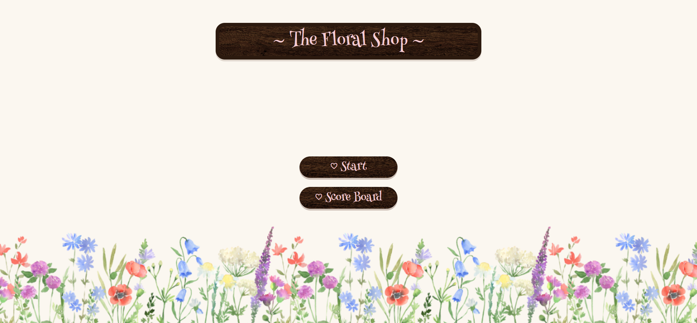
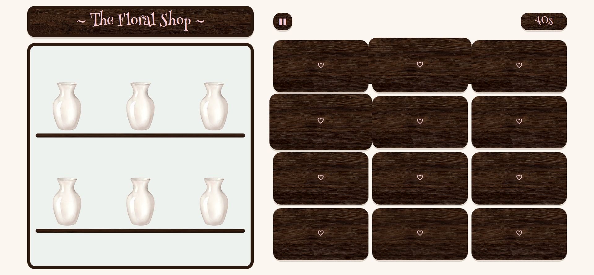
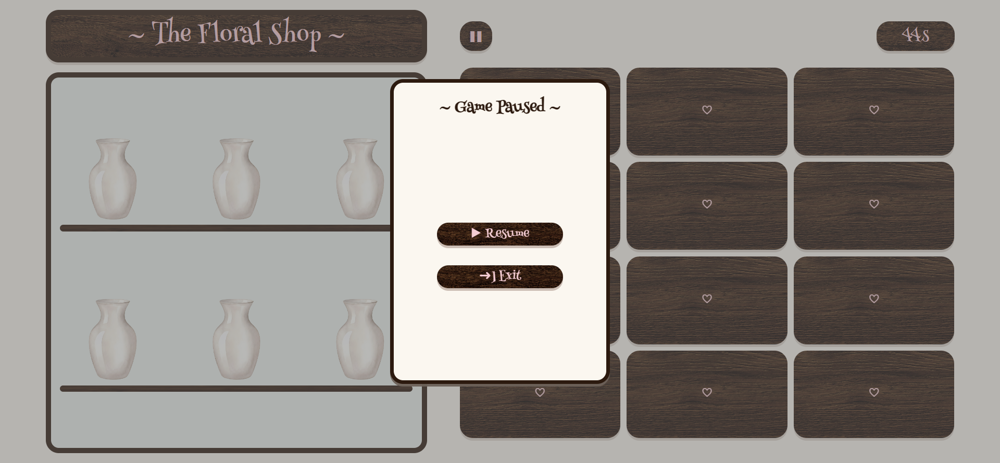
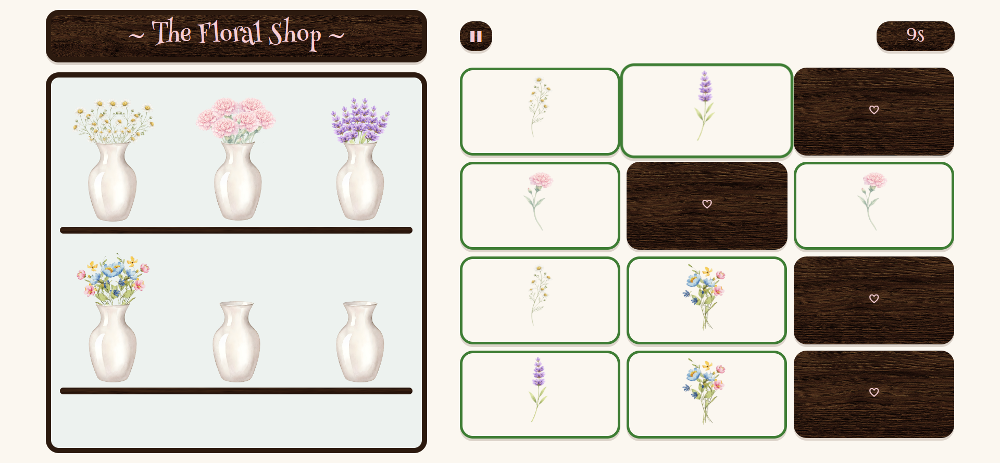
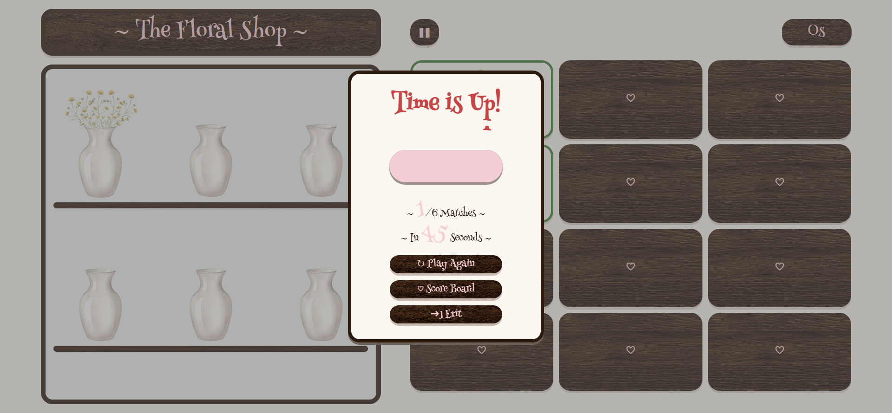
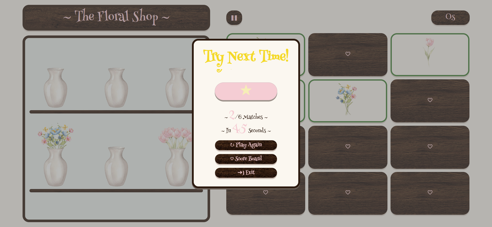
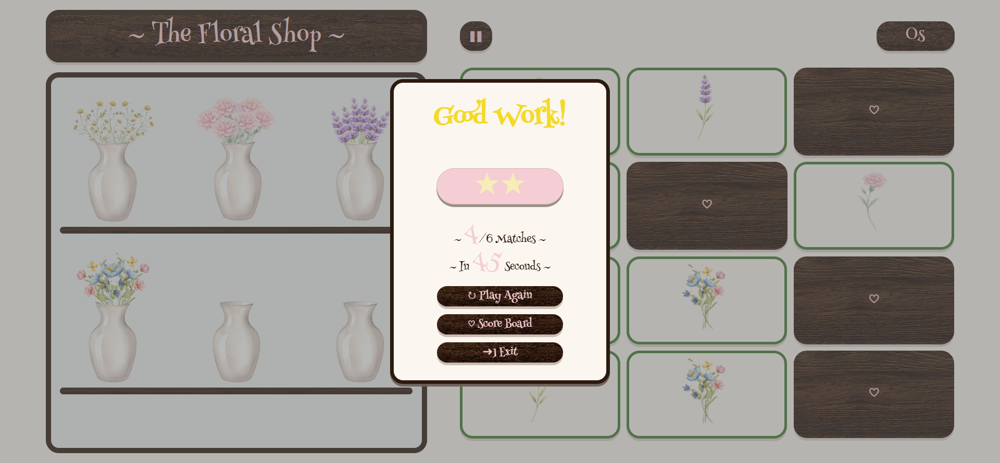
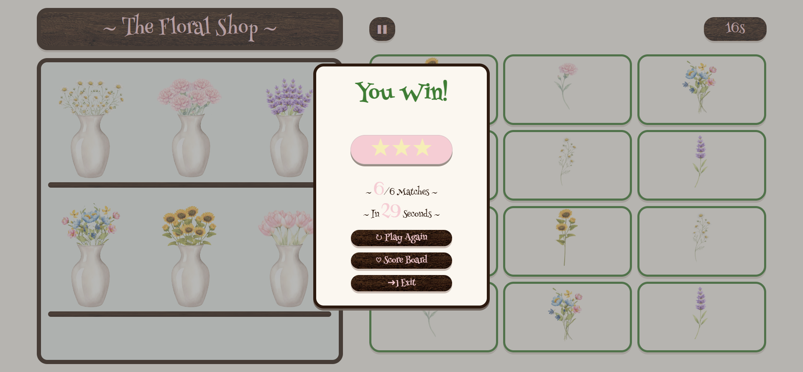
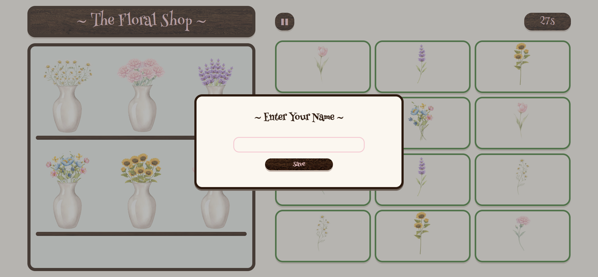
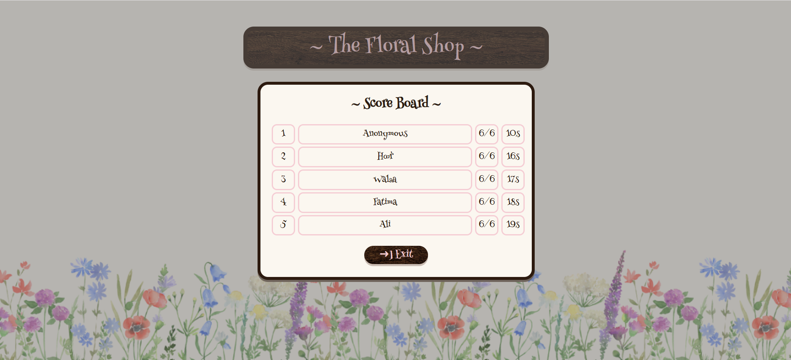

# Project Name
The Floral Shop

## Getting started
[Click Here To Play!](https://hoorhasan30.github.io/Project1-FlowerShop-MemoryCards/)

## Technologies Used
- HTML
- CSS
- JS

## Description
**The Floral Shop** is a browser-based memory matching game with a cozy flower shop theme.

Players flip two cards at a time to find matching flowers. Every successful match fills one of the flower shop's empty vases. The game is timed, so players must finish before the countdown ends.

At the end of the game, players receive a star rating based on their performance:

- ★★★ Complete all matches before the timer finishes.
- ★★ Complete most matches.
- ★ Complete some matches.
- No stars if the score is too low.

If the player earns **3 stars** and finishes with a faster time than one of the existing scores, they are prompted to enter their name and their score is saved using **Local Storage**.

## Features
- Memory card matching game
- 45s countdown timer
- Vase collection that updates after every match
- Pause & resume
- Local storage score board 
- Stars Rating 

## User Stories
- As a user, I want to flip two cards to find matching flower pairs.
- As a user, I want to see a countdown timer while playing.
- As a user, I want to watch the flower shop fill with vases as I make matches.
- As a user, I want to pause and resume the game.
- As a user, I want to see my final score and star rating.
- As a user, I want my best score to appear on the score board if it qualifies.

## Screenshots
### Start Screen

### Gameplay

### Pause Game

### Flipping Cards

### Time is Up!

### Try Next Time!

### Good Work!

### You Win!

### Enter Your Name

### Score Board

## Future Enhancements
- Responsive Design
- Difficulty Based Levels

## Credits
- Card Flip Logic -> https://www.youtube.com/live/rcWBLFXH7uA?si=OOGZR0tO_8R94iTN
