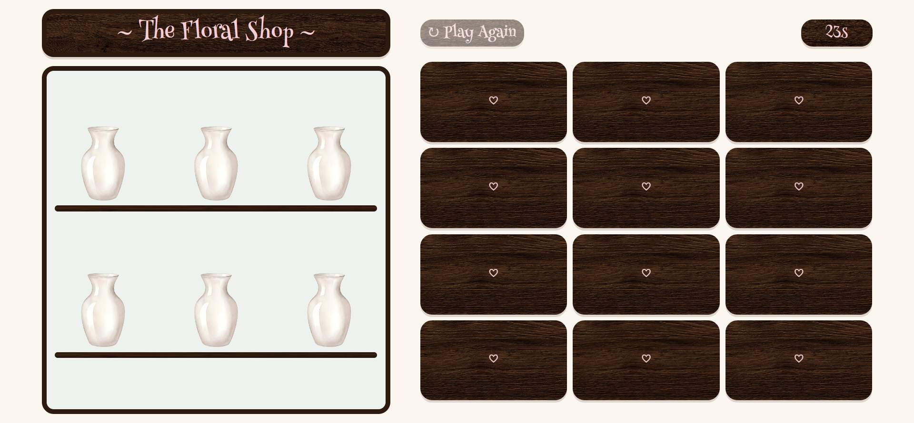

# Project Name
The Floral Shop

## Technologies Used
- HTML
- CSS
- JS

## Description
- It is a memory card game that is in a flower shop theme, The player search for the matching cards to fill the shop vases

## User Stories
- As a user I want to be able to flip 2 cards
- As a user I want to be able to see the game timer
- As a user I want to be able to see the vases that are collected

## Screenshots

## Future Enhancements
- A seperate modal for the win/lose with the time consumed and a "Play Again" button that appears when the game finishes, rather than showing on the same page 

## Credits
- Card Flip Logic -> https://www.youtube.com/live/rcWBLFXH7uA?si=OOGZR0tO_8R94iTN